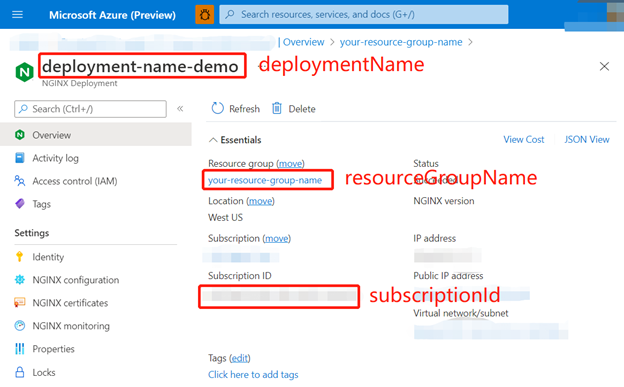
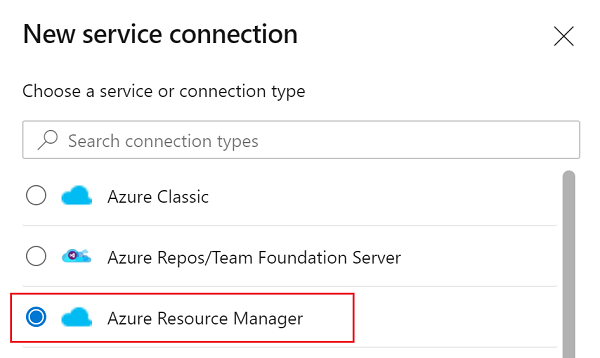

# Azure Pipeline task: NGINX for Azure Configuration Push

## Overview

This is a customed Azure pipeline task that automates the process of synchronizing NGINX configuration files. With this pipeline, the configuration files that are stored and managed in Azure DevOps or GitHub repositories can now be automatically packaged and uploaded to NGINX for Azure deployments.

When creating and updating the configuration of a NGINX for Azure deployment, an automated pipeline task would be very helpful. There are three main advantages of a pipeline task compared to a manual updation:

##### 1. Automation.

A pipeline task can be triggered immediately if designated NGINX coniguration files have changes. This would increase effectiveness when there are frequent modifications and updates.

##### 2. Version control.

NGINX configuration files could be stored in GitHub or Azure DevOps repositories. In this way, all configure changes would be able to be traced and rolled back if there is a mistake.

##### 3. Security.
Pipelines are running in secured and reliable agents, where data is transmitted within Azure services, hence reduced unnecessary data distribution and delivery.

NGINX for Azure currently supports both **GitHub Action** pipeline and **Azure DevOps** pipeline task. While there are some authentication and repository supporting difference, the purpose and functionality of the two pipelines have no essential distinction. For details on GitHub Action pipeline, please check out NGINX for Azure Deployment Action for more details. For Azure DevOps pipeline task, please follow the instructions below.

### Pipeline Task Set-up Guideline

Basically, all that the pipeline task needed is a .yml task written as follows,

```
# example.yml

trigger:
- main

pool:
  vmImage: ubuntu-latest

steps:  
- task: nginx-config-push@0
  inputs:
    serviceConnectionName: '(sercive-connection-name)'
    resourceGroupName: '(resource-group-name)'
    subscriptionId: '(subscription-id)'
    deploymentName: '(deployment-name)'
    sourceConfigFolderPath: '(config-folder-file-path)'
    targetConfigFolderPath: '/etc/nginx/'

```
 
What is needed right now is to get values of the needed variables with following steps:


##### 1. Get your NGINX configuration file ready in the repository.

Upload your NGINX configuration files onto any folder of your Azure DevOps repository. Then update the ‘sourceConfigFolderPath’ to the path of the configuration folder in your repository. Note that the name of the main file of the NGINX configuration folder should be “nginx.conf”, and the ‘targetConfigFolderPath’ would usually be /etc/nginx/.


 
##### 2. Make sure your NGINX for Azure deployment is working properly.

Deploy a NGINX for Azure resource. See Deploy NGINX for Azure | NGINX for Azure Docs. Once your deployment is ready, you will be able to fill in the “resourceGroupName”, “subscriptionId” and the “deploymentName” variable from the portal overview board.


 


##### 3. Create a service connetion and grant permission for the pipeline.

This part would require a little bit more work to set up.
A service connection gives you access to resources in your Azure subscription from your Azure DevOps project.
1.	In Azure DevOps, go to the project that contains your target pipeline. In the lower-left corner, select Project settings.
2.	Under Pipelines, select Service connections. In the upper-right corner, select New service connection.
3.	In New service connection, select Azure Resource Manager.
 


4.	In the Authentication method dialog, select Service principal (automatic) to create a new service principal or select Service principal (manual) to use an existing service principal.
5.	Enter your subscription and resource and a name for your service connection.

Also, you may need to assign a proper role assignment to the service connection so that our pipeline can access NGINX for azure deployments. You can add Contributor as your role assignment to this service connection.


 

Go back to the Azure DevOps project settings and click into the “service connection” tab. Remember the name displayed in the service connections list. This will be the value of ‘serciveConnectionName’ in the .yml file.


 

##### 4. Install the pipeline task and fill all the needed variables into the .yml file on Azure DevOps.

Go to marketplace and search our pipeline task. Once you have the extension installed on your Azure DevOps organization, you will be able to create a pipeline task with the stated .yml file template and use our customized task conveniently. You can also use text editor of the pipeline to utilize a simple UI of this pipeline task.

<br />
<br />

That's it! Once you have all the above settings done and a pipeline created on the Azure DevOps, your NGINX configuration will be automatically updated to your designated NGINX for Azure deployment resource once you have any changes to the files in the repository and the pipeline is triggered. 